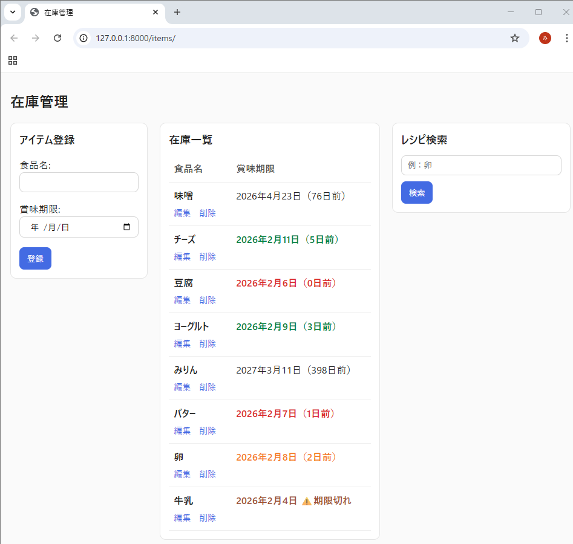
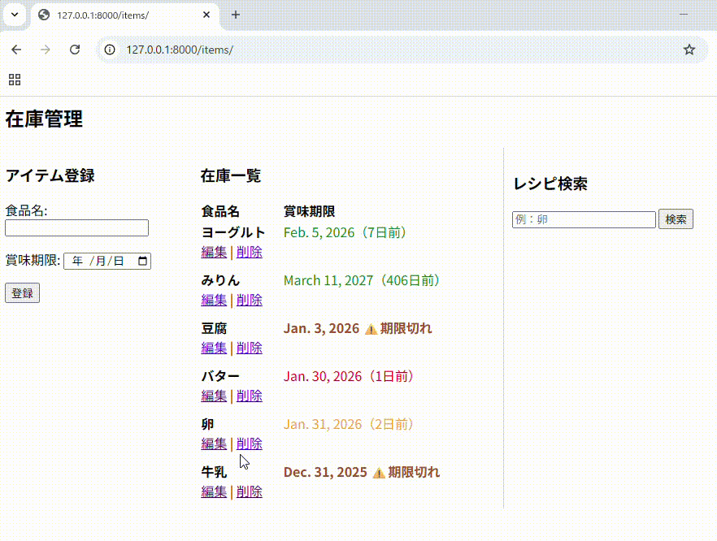
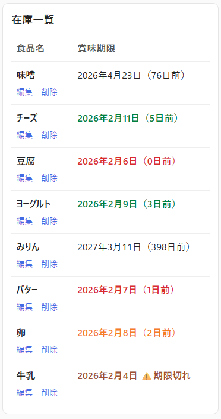
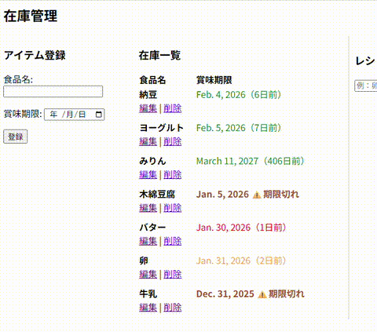
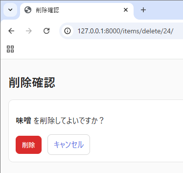
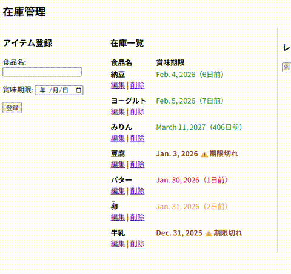
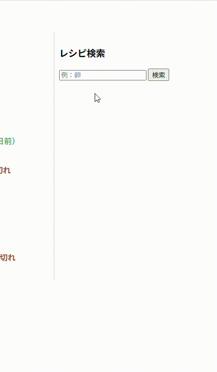
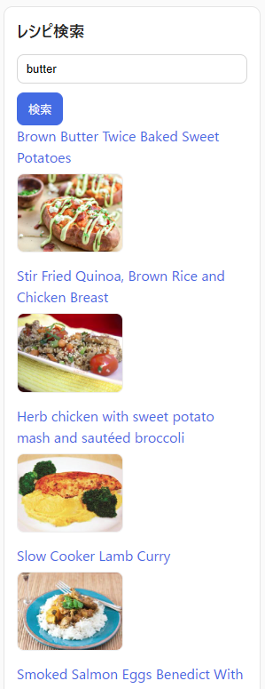
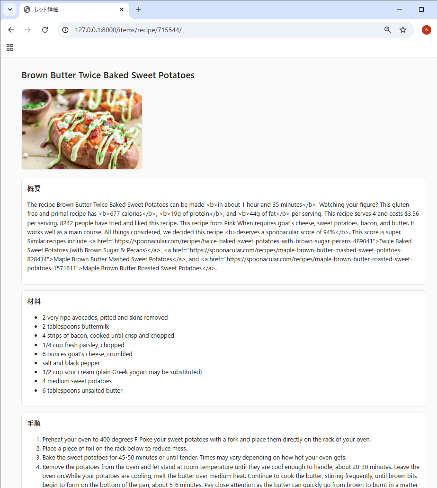

## プロジェクト概要
このプロジェクトは、未経験からWeb開発を学ぶために作成した学習用プロジェクトです。  
プロジェクトを通して、開発の流れや基本的な機能実装の経験を積むことを目的として開発をはじめました。

## アプリ概要
### 一般家庭のキッチンにある食材の在庫管理をするアプリ
賞味期限が切れる前に食材を消費し、食材を余らせることなく在庫管理しやすくする機能があります。

## 開発背景
家にある食材を計画的に使えず、期限切れにしてしまうことが多々ありました。  
冷蔵庫やキッチンにある食材の賞味期限は、現品のラベルを確認しないと把握できず、  
外出先では「何がどれくらい期限が近いのか」を確認できない点に不便さを感じていました。  
そこで、食材とその賞味期限を外出先からでも確認できるようにし、賞味期限が近い食材を  
優先的に使ったレシピを外出先からでも事前に考えられるツールを作りたいと考えました。

本アプリを利用することで
- 帰宅後すぐに調理に取り掛かることができる  
- 作りたい料理に不足している食材を帰宅途中で購入できる  
- 食材の賞味期限を一目で把握でき、食品ロスを減らせる  

このように、日常生活で感じていた食材管理のやりにくさを解消するため  
在庫の全体像を最新の状態で確認できるツールが欲しいと思い開発に至りました。

## 機能概要
### トップページ全体

### 食材＋賞味期限 の登録
食材名と賞味期限を登録できます。  
登録された食材＋賞味期限は一覧表示に追加されます。

### 一覧表示と色分け表示機能
登録された食材と賞味期限が一覧表示されます。  
賞味期限までの残り日数に応じて食材ごとに色分け表示され、  
賞味期限が迫っている食材の緊急度を知らせる機能です。

＜色分けルール＞  
賞味期限切れ　　　　→　茶色表示＋⚠️  
賞味期限当日・前日　→　赤色表示  
賞味期限２日前　　　→　オレンジ色表示  
賞味期限３～５日前　→　緑色表示  
賞味期限６日以上前　→　デフォルト表示(黒色文字)  

### 食材・賞味期限 の 編集・削除
  登録した食材の削除ができます。  

登録した食材の食材名・賞味期限が編集できます。

### レシピ検索機能
消費したい食材を検索ボックスに入力して検索すると、  
その食材を使用したレシピの検索結果が一覧表示されます。  
賞味期限が迫っている食材を消費したいとき、レシピのアイデアを得るのに便利です。

## 画面・URL設計
### 操作フロー
- アプリにアクセス：`/` → `/items/`（在庫一覧画面へ）
- 在庫を登録：`/items/` で食品名・賞味期限を入力 → 登録 → 一覧に反映
- 在庫を編集：一覧の「編集」→ 編集画面 → 保存 → 一覧へ戻る
- 在庫を削除：一覧の「削除」→ 確認画面 → 削除 → 一覧へ戻る
- レシピを探す：`/items/` 右カラムでキーワード検索 → 検索結果が右カラムだけ更新
- レシピ詳細を見る：検索結果のレシピをクリック → 詳細ページ → 戻る

### URL設計
本アプリは「在庫一覧 + 登録 + レシピ検索」を `/items/` に集約し、編集・削除・レシピ詳細のみ個別ページに分けています。  
また、レシピ検索はページ全体を再描画せず、右カラムのみ非同期で更新します。

|URL|Method|View|Response / Template|用途 / 補足|
|---|---:|---|---|---|
|`/`|GET| - |Redirect → `/items/`|ルートアクセスは一覧画面へ誘導|
|`/items/`|GET|`item_list`|ページHTML `item_list.html`|在庫一覧 + 登録フォーム + レシピ検索UIを表示|
|`/items/`|POST|`item_list`|Redirect → `/items/`|アイテム登録（PRGパターンで二重送信を防止）|
|`/items/edit/<int:pk>/`|GET|`item_edit`|ページHTML `item_edit.html`|編集フォーム表示|
|`/items/edit/<int:pk>/`|POST|`item_edit`|Redirect → `/items/`|編集内容を保存して一覧へ戻る|
|`/items/delete/<int:pk>/`|GET|`item_delete`|ページHTML `item_confirm_delete.html`|削除確認画面（誤削除防止）|
|`/items/delete/<int:pk>/`|POST|`item_delete`|Redirect → `/items/`|削除実行して一覧へ戻る|
|`/items/recipe-search/`|GET|`recipe_search`|部分HTML `_recipe_results.html`|JS(fetch)で呼び出し、レシピ検索結果部分のみ差し替え|
|`/items/recipe/<int:recipe_id>/`|GET|`recipe_detail`|ページHTML `recipe_detail.html`|レシピ詳細表示（取得できない場合は404）|

### 非同期更新（右カラム差し替え）
`/items/recipe-search/?q=...` はページ全体ではなく **検索結果のHTML断片（partial）** を返します。  
`inventory/static/inventory/app.js` から fetch し、返ってきたHTMLを `#recipe-results` に差し込むことで右カラムのみ更新します。

## 設計で工夫した点
このアプリでは「機能が少ない＝設計が不要」ではなく、将来の拡張や保守を意識し、**責務の分離** と **失敗しても画面が壊れない実装** を意識しました。

### 1. 1画面に集約しつつ、処理は責務ごとに分離
在庫管理（登録＋一覧＋レシピ検索）は `/items/` に集約し、ユーザーの基本操作を1画面で完結させています。  
一方で、ビュー内の役割が肥大化しないように以下の方針で分離しました。

- 在庫データ取得：`services/inventory_service.py`
- レシピAPI呼び出し：`services/spoonacular_service.py`
- 画面の入口（HTTP処理）：`views.py`

これにより、UIが1ページでも「データ取得」「外部API」「HTTP処理」を混ぜずに読みやすい構成にしています。

### 2. 表示ロジックはモデル側に寄せ、テンプレートをシンプルに
賞味期限の残日数は `InventoryItem.days_left`（property）で計算し、テンプレートでは `item.days_left` を参照するだけにしています。  
ビュー側で日付計算を毎回書かずに済むため、表示ロジックの重複を減らし、修正箇所を少なくできます。

### 3. レシピ検索は「部分更新」用エンドポイントを分けてUXと保守性を両立
レシピ検索は一覧画面の右カラムのみ更新できると使いやすいため、検索結果だけ返す専用エンドポイントを用意しました。

- `/items/recipe-search/`：検索結果の **partial HTML**（`_recipe_results.html`）のみ返す
- `app.js`：fetchで取得し、`#recipe-results` だけ差し替え

フルページ再読み込みを避けつつ、SPA化はせずに「必要な箇所だけ非同期化」する方針で実装コストを抑えています。

### 4. 外部API連携は「検索」と「詳細」を分離し、失敗しても画面が壊れないように設計
Spoonacular APIは用途別に関数を分けています。

- `search_recipes()`：検索結果（一覧用）を返す
- `fetch_recipe_detail()`：詳細表示用データを返す

どちらもタイムアウトを設定し、例外時は空結果 / `None` を返すことで、通信失敗時でもテンプレートが壊れないようにしています。  
詳細取得に失敗した場合は `404` として扱い、存在しないページとして安全に処理します。

### 5. 秘密情報はコードに直書きしない（環境変数 + .env）
外部APIキーやDjangoのSECRET_KEYは `.env` を読み込み、環境変数から取得する設計にしています。

- 公開リポジトリに秘密情報が含まれない
- 開発/本番など環境ごとに設定を切り替えやすい

### 6. 削除は確認画面を挟み、GET/POSTを分けて誤操作を防止
削除機能は `GET=確認画面表示 / POST=削除実行` に分けています。  
誤削除を防ぎ、ブラウザ操作（戻る・更新）でも意図しない削除が起きにくい構成にしています。

## 学んだこと
- Webアプリ開発の基本的な仕組みと開発のおおまかな流れ
- Linuxの使い方
- 仮想環境の設定
- DB設計手法（正規化など）
- Djangoの基本的なCRUD処理の理解
- MVCモデル（MVTモデル）の考え方
- VS Codeの操作
- 簡単なフロントエンド表示（色分けなど）
- 外部APIの実装
- バグ修正や簡易機能修正
- Gitによるバージョン管理
- 秘密情報の管理方法（スクリプトに書かない方法）

## 今後の課題・改善点
- レシピ検索機能（現状：英語検索しかできない、賞味期限近い食材から直接検索・組み合わせて検索などができない）
- ユーザー認証・権限管理の追加
- テストの導入
- UI/UX改善
- セキュリティ面の強化
- デプロイ未経験
- その他、認識できていない改善点や課題を調査中

## 動作環境
- Python 3.11
- Django 5.0.14
- Ubuntu 22.04（WSL上）

## 注意事項
学習用プロジェクトのため、セキュリティ面や機能の完成度は保証されません。  
今後も機能追加・改善を続ける予定です。