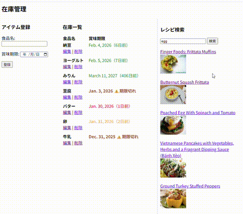

## アプリ概要
### 一般家庭のキッチンにある食材の在庫管理アプリ
### 賞味期限が切れる前に食品を消費することを目的とした機能が搭載されています。

このプロジェクトは、未経験からWeb開発を学ぶために作成した学習用プロジェクトです。

プロジェクトを通して、開発の流れや基本的な機能実装の経験を積むことを目的としています。

## 開発背景
家にある食材を計画的に使えず、賞味期限切れにしてしまうことが多々ありました。

冷蔵庫やキッチンにある食材の賞味期限は、現品のラベルを確認しないと把握できず、  

外出先では「何がどれくらい期限が近いのか」を確認できない点に不便さを感じていました。

そこで、冷蔵庫内やキッチンにある食材とその賞味期限を外出先からでも確認できるようにし、  

賞味期限が近い食材を優先的に使ったレシピを事前に考えられるツールを作りたいと考えました。

本アプリを利用することで、  
- 帰宅後すぐに調理に取り掛かれる  
- 作りたい料理に不足している食材を帰宅途中で購入できる  
- 食材の賞味期限を一目で把握でき、食品ロスを減らせる  

といった課題解決が可能になります。

日常生活で感じていた「食材管理の煩雑さ」を解消するため、  
在庫の全体像を常に最新の状態で確認できるツールとして本アプリを開発しました。

## 機能概要
一般家庭のキッチンにある食材の在庫管理（賞味期限管理）をするアプリです。

- 食材名 + 賞味期限の登録 ⇒ 一覧表示
- 一覧に登録した食材項目の編集と削除
- 賞味期限までの残り日数に応じた色分け表示＆アラート表示機能
- レシピ検索機能

### ページ全体

### 食材＋賞味期限 の登録
食材名と賞味期限を登録できます。

登録された食材＋賞味期限は一覧表示に追加されます。

<h3>一覧表示と色分け表示機能</h3>

  

    

      登録された食材と賞味期限が一覧表示されます。 
      賞味期限までの残り日数に応じて食材ごとに色分け表示され、
      賞味期限が迫っている食材の緊急度を知らせる機能です。
    

    
<strong>＜色分けルール＞</strong>

    <ul>
      <li>賞味期限切れ → 茶色表示＋⚠️</li>
      <li>賞味期限当日・前日 → 赤色表示</li>
      <li>賞味期限2日前 → オレンジ色表示</li>
      <li>賞味期限3〜5日前 → 緑色表示</li>
      <li>賞味期限6日以上前 → デフォルト表示（黒色）</li>
    </ul>
  

  

    
  

### 食材・賞味期限 の 編集・削除
登録した食材の食材名・賞味期限が編集できます。

登録した食材の削除ができます。

### レシピ検索機能
消費したい食材を検索ボックスに入力して検索すると、

その食材を使用したレシピの検索結果が一覧表示されます。

賞味期限が迫っている食材を消費したいとき、レシピのアイデアを得るのに便利です。

## 学んだこと
- Webアプリ開発の基本的な仕組みと開発のおおまかな流れ
- Linuxの使い方
- 仮想環境の設定
- DB設計手法（正規化など）
- Djangoの基本的なCRUD処理の理解
- MVCモデル（MVTモデル）の考え方
- VS Codeの操作
- テンプレートやフォームの操作経験
- 簡単なフロントエンド表示（色分けなど）
- Python, HTMLのコーディング
- 外部APIの実装
- バグ修正や簡易機能修正
- Gitによるバージョン管理
- 秘密情報の管理方法（スクリプトに書かない方法）

## 今後の課題・改善点
- レシピ検索機能（現状：英語検索しかできない、賞味期限近い食材から直接検索・組み合わせて検索などができない）
- ユーザー認証・権限管理の追加
- テストの導入
- UI/UX改善
- セキュリティ面の強化
- デプロイ未経験
- デザインの改善
- その他、認識できていない改善点や課題を調査中

## 動作環境
- Python 3.11
- Django 4.2
- Ubuntu 22.04（WSL上）

## 注意事項
学習用プロジェクトのため、セキュリティ面や機能の完成度は保証されません。

今後も機能追加・改善を続ける予定です。
